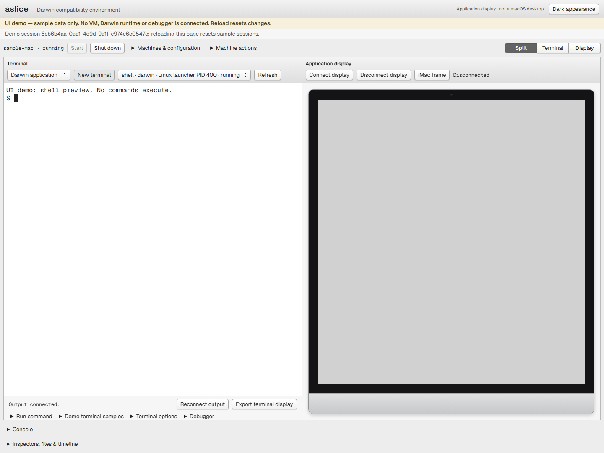
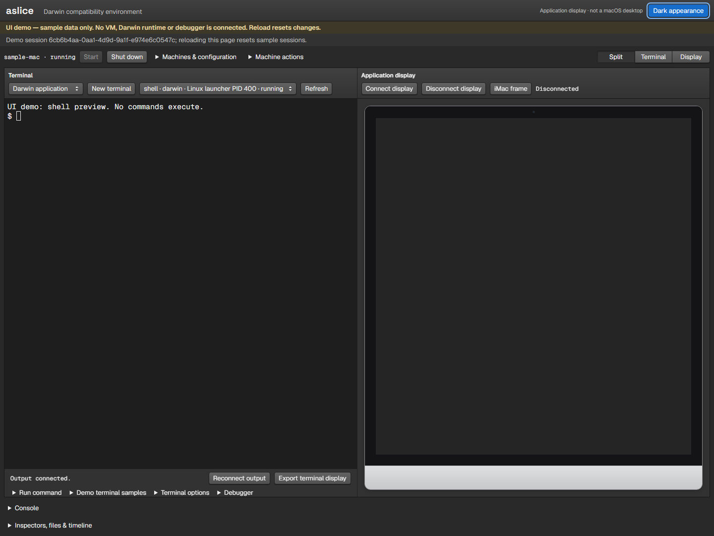

# Simulator console

The simulator provides a local workspace for machine controls, terminal sessions,
application display, file transfers, and diagnostics. The controller and a prepared
runtime run on your machine; GitHub Pages serves this introduction as static content.

## A workspace for terminal and application output

The toolbar controls the selected machine. The central workspace gives terminal
sessions and the application display priority, with configuration and inspection
in adjoining panes. Terminal, application, and combined views keep the working
area useful at different window sizes.

These screenshots were captured directly from the repository's compiled console
using its development sample transport. The visible sample machine and terminal
are UI fixtures, not evidence of a running Darwin guest, executed guest commands,
or platform qualification. No interactive simulator is included in this site.

## Explicit appearance controls

Light is the default. The Dark appearance button saves your choice; it does not
follow the operating system. Appearance changes affect the surrounding controls
and leave guest application images unchanged. Keyboard focus stays visible.

## Use it locally

Read the [simulator guide](../simulator/README.md) for the controller,
runtime prerequisites, machine lifecycle, and known limitations. The
[console build guide](../simulator/web/README.md) covers installation,
local development, and compiled preview. The compiled console targets Safari 9
on OS X 10.11; automated compatibility checks do not replace testing on that platform.

For the system behind the console, see [Developing](../../docs/DEVELOPING.md)
and the [design specification](../../docs/DESIGN.md).
